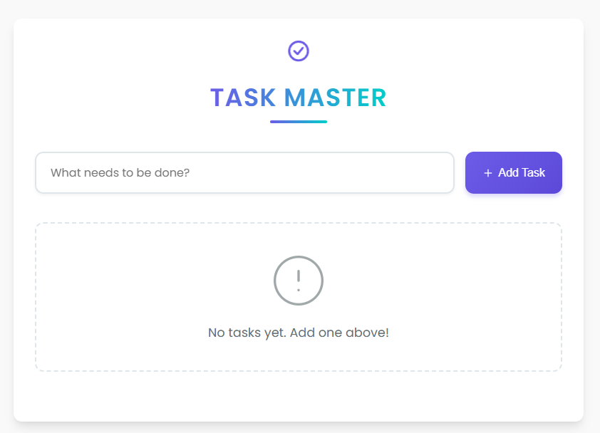

# Go Todo App

A modern, full-featured Todo application with a Golang backend API and React frontend with TypeScript.



## Features

- ✅ **Create** new todo tasks with an intuitive interface
- 📝 **Edit** existing tasks with inline editing
- ✓ **Mark tasks as completed** with visual indication
- 🗑️ **Delete** tasks with confirmation dialog to prevent accidental deletion
- 🔍 **Filter** tasks by status (All/Active/Completed)
- 📊 **Statistics** showing active and completed task counts
- 🧹 **Clear** all completed tasks at once
- 🎨 **Modern UI** with animations, transitions, and a clean design
- 📱 **Responsive design** for desktop and mobile devices

## Project Structure

```
├── backend/                  # Go backend API
│   ├── handlers/             # HTTP request handlers
│   ├── models/               # Data models
│   ├── repositories/         # Data access layer
│   └── main.go               # Entry point
└── frontend/                 # React frontend
    ├── public/               # Static assets
    └── src/
        ├── components/       # React components
        ├── services/         # API services
        ├── types/            # TypeScript definitions
        └── styles/           # CSS styles
```

## Backend

The backend is a RESTful API built with Go and the Gin framework. It provides endpoints for creating, reading, updating, and deleting todos.

### Tech Stack

- **Go (Golang)** - Programming language
- **Gin Web Framework** - HTTP routing and middleware
- **UUID** - For generating unique identifiers
- **RESTful Architecture** - API design principles
- **In-memory Repository Pattern** - Data storage (can be extended to use a database)

### API Endpoints

| Method | Endpoint                | Description             | Request Body    | Response         |
|--------|-------------------------|-------------------------|----------------|-----------------|
| GET    | /api/todos              | Get all todos           | -              | Array of todos   |
| GET    | /api/todos/:id          | Get todo by ID          | -              | Single todo      |
| POST   | /api/todos              | Create new todo         | `{"title": ""}` | Created todo     |
| PUT    | /api/todos/:id          | Update todo             | Todo object    | Updated todo     |
| PATCH  | /api/todos/:id/toggle   | Toggle todo status      | -              | Updated todo     |
| DELETE | /api/todos/:id          | Delete todo             | -              | 204 No Content   |

### Code Structure

```
backend/
├── handlers/
│   └── todo_handler.go       # API endpoint handlers
├── models/
│   └── todo.go               # Todo data structure
├── repositories/
│   └── todo_repository.go    # Data access layer
└── main.go                   # Server initialization and routes
```

### Running the Backend

```bash
cd backend
go mod tidy
go run main.go
```

The server will start on http://localhost:8080

## Frontend

The frontend is a modern React application built with TypeScript that provides a clean, intuitive interface for managing todos.

### Tech Stack

- **React** - UI library for building component-based interfaces
- **TypeScript** - For type safety and better developer experience
- **Axios** - For API communication
- **React Icons** - For UI iconography
- **CSS Variables** - For consistent theming
- **CSS Animations** - For smooth transitions and visual feedback

### Features

- **Intuitive Task Management:**
  - Add, edit, delete todos with a clean interface
  - Mark todos as complete/incomplete with visual feedback
  - Delete confirmation dialog to prevent accidental deletions
  
- **Organizational Tools:**
  - Filter todos (All, Active, Completed)
  - Clear completed todos with one click
  - Statistics showing remaining and completed todos
  
- **Modern UI/UX:**
  - Clean, minimalist design with a modern color palette
  - Animations and transitions for a polished experience
  - Responsive design that works on mobile and desktop
  - Visual feedback for all user interactions

### Component Structure

```
frontend/src/
├── components/
│   ├── AppLogo.tsx          # App logo with animation
│   ├── ConfirmDialog.tsx    # Reusable confirmation dialog
│   ├── TodoFilters.tsx      # Filter and clear controls
│   ├── TodoForm.tsx         # New todo input form
│   ├── TodoItem.tsx         # Individual todo item with actions
│   └── TodoList.tsx         # Container for todo items
├── services/
│   └── TodoService.ts       # API communication layer
├── types/
│   └── Todo.ts              # TypeScript interfaces
├── App.tsx                  # Main application component
├── index.tsx                # Entry point
├── react-adapter.ts         # React type compatibility
└── index.css                # Global styles and animations
```

### Running the Frontend

```bash
cd frontend
npm install
npm start
```

The application will start on http://localhost:3000

### TypeScript Configuration

This project uses TypeScript with React 16, which requires specific configuration:

1. **Dependencies setup:**
   ```bash
   npm install @types/react@16.14.45 @types/react-dom@16.9.19 react@16.14.0 react-dom@16.14.0
   ```

2. **React Adapter Pattern:**
   We use a custom adapter to simplify React usage with TypeScript:
   ```typescript
   import React, { useState, useEffect } from './react-adapter';
   ```

3. **Custom Type Declarations:**
   Declaration files in `/src/types` and `react-app-env.d.ts` provide type definitions for:
   - Todo data structure
   - JSX SVG elements (path, circle, polyline, line)
   - API response types

4. **TSConfig settings:**
   ```json
   {
     "compilerOptions": {
       "jsx": "react",
       "noImplicitAny": false,
       "esModuleInterop": true,
       "allowSyntheticDefaultImports": true
     }
   }
   ```

## Development

### Prerequisites

- Go 1.18 or higher
- Node.js 14 or higher
- npm 6 or higher

### Quick Start

You can start both the backend and frontend with a single command:

```bash
.\start.bat
```

This will start the Go backend on port 8080 and the React frontend on port 3000.

## UI Design

The application uses a modern, clean design with a carefully selected color palette and consistent visual language:

### Color Scheme

```css
:root {
  --primary-color: #6c5ce7;       /* Main brand color */
  --primary-light: #a29bfe;       /* Lighter variant */
  --primary-dark: #5c49d9;        /* Darker variant */
  --accent-color: #00cec9;        /* Accent color */
  --success-color: #00b894;       /* Completed/success indicators */
  --warning-color: #fdcb6e;       /* Warning indicators */
  --error-color: #ff7675;         /* Error/delete indicators */
  --text-primary: #2d3436;        /* Main text color */
  --text-secondary: #636e72;      /* Secondary text */
  --background-main: #f9f9f9;     /* Main background */
  --background-light: #ffffff;    /* Card/component background */
}
```

### Key UI Components

- **Todo Item:** Cards with consistent spacing, subtle shadows, and clear visual hierarchy
- **Form Inputs:** Clean, accessible inputs with focus states and visual feedback
- **Buttons:** Consistent styling with hover/active states and appropriate colors based on function
- **Animations:** Subtle transitions and animations to enhance the user experience
- **Empty States:** Helpful visual cues when no todos exist
- **Confirmation Dialogs:** Modal overlays to confirm destructive actions

### Responsive Design

The application is fully responsive and adapts to different screen sizes:

- **Desktop:** Full layout with side-by-side elements and spacious design
- **Tablet:** Adjusted spacing and layout for medium-sized screens
- **Mobile:** Stacked elements, full-width inputs, and touch-friendly tap targets

## Future Enhancements

- [ ] User authentication and personalized todo lists
- [ ] Due dates and reminders for tasks
- [ ] Categories and tags for better organization
- [ ] Dark mode theme toggle
- [ ] Drag-and-drop reordering of tasks
- [ ] Data persistence with a database (MongoDB, PostgreSQL)
- [ ] Task priority levels
- [ ] Search functionality
- [ ] Collaborative todo lists (shared between users)
- [ ] Offline support with local storage
- [ ] Progressive Web App (PWA) features

## License

MIT License

## Author

RensithUdara

MIT
